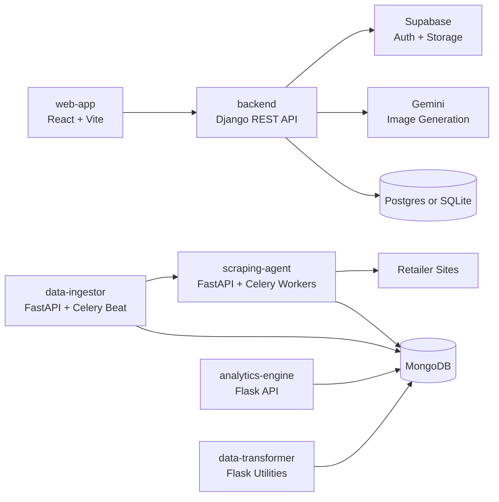

<p align="center">
  
</p>

<p align="center">
  <strong>Open-source fashion intelligence, product discovery, scraping, ingestion, and AI try-on tooling.</strong>
</p>

<p align="center">
  <a href="LICENSE"></a>
  
  
  
  
</p>

# Wearlytic

Wearlytic is a fashion-tech monorepo for building product discovery and market intelligence workflows across clothing brands. It combines a React web app, a Django REST API, FastAPI scraping and ingestion services, MongoDB-backed warehousing, Supabase authentication/storage, and Gemini-powered image generation.

The project is designed so contributors can work on individual services independently while still supporting an end-to-end pipeline: discover products, scrape fashion retailers, ingest data into a warehouse, browse and filter products, manage user style profiles, and generate AI-assisted outfit imagery.

## Contents

- [Features](#features)
- [Architecture](#architecture)
- [Repository Structure](#repository-structure)
- [Tech Stack](#tech-stack)
- [Quick Start](#quick-start)
- [Environment Variables](#environment-variables)
- [Development Workflow](#development-workflow)
- [Testing](#testing)
- [Contributing](#contributing)
- [License](#license)

## Features

- Product discovery interface with category and price filtering
- Supabase OAuth authentication and JWT-protected API access
- User profile management with base-image upload support
- AI image generation using user profile context plus selected product images
- Modular scraping framework for supported fashion and marketplace sites
- Asynchronous scraping jobs with Celery workers and Redis queues
- Data ingestion service for sources, listings, batches, statuses, and product warehouse records
- MongoDB-backed analytics endpoints for brands, colors, categories, prices, seasons, and designs
- Separate transformer utilities for product annotation and enrichment workflows

## Architecture



The services can be run independently during development. A full local pipeline requires MongoDB, Redis, Supabase credentials, and relevant AI/API credentials.

## Repository Structure

| Path | Purpose |
| --- | --- |
| `web-app/` | Main React 19 + Vite + Tailwind web application for product discovery, profile management, and image-generation workflows. |
| `backend/` | Django REST API for users, products, categories, Supabase JWT auth, Supabase Storage integration, and Gemini image generation. |
| `scraping-agent/` | FastAPI scraping service with Celery workers, scraper contracts, site-specific scrapers, loaders, and tests. |
| `data-ingestor/` | FastAPI admin/orchestration service for sources, listings, batches, ingestion state, Celery Beat scheduling, and warehouse operations. |
| `analytics-engine/` | Flask analytics API over MongoDB product data. |
| `data-transformer/` | Flask and Gemini-based data annotation/enrichment utilities. |
| `frontend/` | Legacy static frontend prototypes and older assets. |
| `product_warehouse_cleaned.json` | Cleaned sample product warehouse data. |

## Tech Stack

| Layer | Technologies |
| --- | --- |
| Web app | React 19, Vite 7, Tailwind CSS 4, React Router, Supabase JS |
| API | Django 5, Django REST Framework, PyJWT, Supabase Python client |
| Scraping | FastAPI, Celery, Redis, Playwright, Selenium, BeautifulSoup, Requests |
| Data | MongoDB, PostgreSQL/Supabase Postgres, SQLite for local API fallback |
| AI | Google Gemini image generation and annotation utilities |
| Deployment configs | Vercel config for web/API components, Render config for analytics |

## Quick Start

### Prerequisites

- Git
- Node.js 20+
- Python 3.11+
- MongoDB for scraping, ingestion, analytics, and transformer workflows
- Redis or Upstash Redis for Celery queues
- Supabase project for auth, Postgres, and Storage-backed image assets
- Gemini API key for AI image generation and transformer utilities

### 1. Clone the repository

```bash
git clone https://github.com/<your-org-or-user>/Wearlytic.git
cd Wearlytic
```

### 2. Run the web app

```bash
cd web-app
npm install
npm run dev
```

The Vite app runs on `http://localhost:5173` by default.

### 3. Run the Django API

```bash
cd backend
python -m venv .venv
source .venv/bin/activate
pip install -r requirements.txt
python manage.py migrate
python manage.py runserver
```

The API runs on `http://localhost:8000` by default. Without Postgres configuration, it falls back to local SQLite.

### 4. Run the scraping agent

```bash
cd scraping-agent
python -m venv .venv
source .venv/bin/activate
pip install -r requirements.txt
uvicorn main:app --reload --port 8080
```

For background scraping jobs, also start Celery workers:

```bash
celery -A api.celery_worker.celery_app worker -Q scraping_agent_scrape_medium --loglevel=info --concurrency=5
```

### 5. Run the data ingestor

```bash
cd data-ingestor
python -m venv .venv
source .venv/bin/activate
pip install -r requirements.txt
uvicorn main:app --reload --port 8081
```

For scheduled ingestion workflows, also start the worker and beat processes:

```bash
celery -A app.celery_worker worker -Q data_ingestor_queue -P solo -c 1 --loglevel=info
celery -A app.celery_worker beat --loglevel=info
```

### 6. Run optional analytics and transformer services

```bash
cd analytics-engine
pip install -r requirements.txt
python api.py
```

```bash
cd data-transformer
pip install -r requirements.txt
python api.py
```

## Environment Variables

Create local `.env` files inside the service folders that need them. Do not commit secrets.

| Service | Variables |
| --- | --- |
| `web-app` | `VITE_API_BASE_URL`, `VITE_SUPABASE_URL`, `VITE_SUPABASE_ANON_KEY` |
| `backend` | `DATABASE_URL` or `SUPABASE_DB_HOST`, `SUPABASE_DB_NAME`, `SUPABASE_DB_USER`, `SUPABASE_DB_PASSWORD`, `SUPABASE_DB_PORT`, `SUPABASE_DB_SSLMODE`; plus `SUPABASE_URL`, `SUPABASE_SERVICE_ROLE_KEY`, `SUPABASE_BUCKET`, `SUPABASE_PROJECT_ID`, `SUPABASE_JWT_SECRET`, `GEMINI_API_KEY` |
| `scraping-agent` | `MONGO_URI`, `MONGO_DBNAME`, `API_ACCESS_TOKEN`, `RUN_TYPE_LOCAL`, `UPSTASH_REDIS_HOST`, `UPSTASH_REDIS_PORT`, `UPSTASH_REDIS_PASSWORD`, `PLATFORM` |
| `data-ingestor` | `SCRAPING_AGENT_API_URL`, `SCRAPING_AGENT_TOKEN`, `MONGO_URI`, `MONGO_DBNAME`, `ADMIN_USERNAME`, `ADMIN_PASSWORD`, `MAXIMUM_BATCH_SIZE`, `MAXIMUM_BATCHES_TO_PROCESS`, `UPSTASH_REDIS_HOST`, `UPSTASH_REDIS_PORT`, `UPSTASH_REDIS_PASSWORD`, and collection-name variables used by the DB modules |
| `analytics-engine` | `MONGODB_URI` |
| `data-transformer` | `MONGODB_URI`, `GOOGLE_API_KEY` |

## Development Workflow

Common ports:

| Service | Default URL |
| --- | --- |
| Web app | `http://localhost:5173` |
| Django API | `http://localhost:8000` |
| Scraping agent | `http://localhost:8080` |
| Data ingestor | `http://localhost:8081` |
| Analytics engine | `http://localhost:5000` |

Useful commands:

```bash
# web app checks
cd web-app
npm run lint
npm run build
```

```bash
# backend checks
cd backend
python manage.py test
```

```bash
# scraping agent tests
cd scraping-agent
make test-scraperkit
```

Supported scraper implementations currently include Amazon, BluOrng, Jaywalking, Myntra, and The Souled Store. Scraper tests may make live network requests and require a valid `PLATFORM` setting for Selenium-based loaders.

## API Overview

### Django API

| Endpoint | Purpose |
| --- | --- |
| `POST /users/create/` | Create or update an app user from Supabase identity data. |
| `GET /users/me/` | Return the authenticated user profile. |
| `PATCH /users/<user_id>/` | Update profile details. |
| `PATCH /users/<user_id>/base_image/` | Upload or replace the user's base image. |
| `GET /products/` | List products with category and price filters. |
| `GET /products/<product_id>/` | Fetch a product by ID. |
| `GET /categories/` | List product categories. |
| `POST /image_generations/` | Generate an AI outfit/product image from selected products. |
| `GET /users/me/generations/` | List generated images for the current user. |
| `POST /auth/validate/` | Validate the authenticated request. |

### Scraping Agent API

| Endpoint | Purpose |
| --- | --- |
| `POST /api/scrape` | Start a scraping job. |
| `GET /api/scrape/{task_id}/status/` | Check scraping job status. |
| `GET /api/scrape/{task_id}/result/` | Fetch scraping results. |

## Testing

Run the checks for the area you changed before opening a pull request:

```bash
cd web-app && npm run lint && npm run build
cd backend && python manage.py test
cd scraping-agent && make test-scraperkit
```

Some integration paths need external services and credentials. If a test cannot be run locally, document the reason in the pull request.

## Contributing

Contributions are welcome. Good first areas include adding scraper coverage, improving environment examples, expanding API tests, hardening ingestion workflows, documenting deployment paths, and improving the web-app experience.

1. Fork the repository and create a focused feature branch.
2. Keep changes scoped to one feature, bug fix, or documentation improvement.
3. Follow the patterns already used in the service you are editing.
4. Add or update tests when changing runtime behavior.
5. Run the relevant checks and include the results in your pull request.

For larger changes, open an issue first so maintainers and contributors can align on design and scope.

## Security

Never commit `.env` files, service-role keys, database URLs, OAuth secrets, or API keys. If you discover a vulnerability, avoid posting exploit details publicly and contact the maintainers through the repository's preferred security channel.

## License

Wearlytic is released under the [Apache License 2.0](LICENSE).
