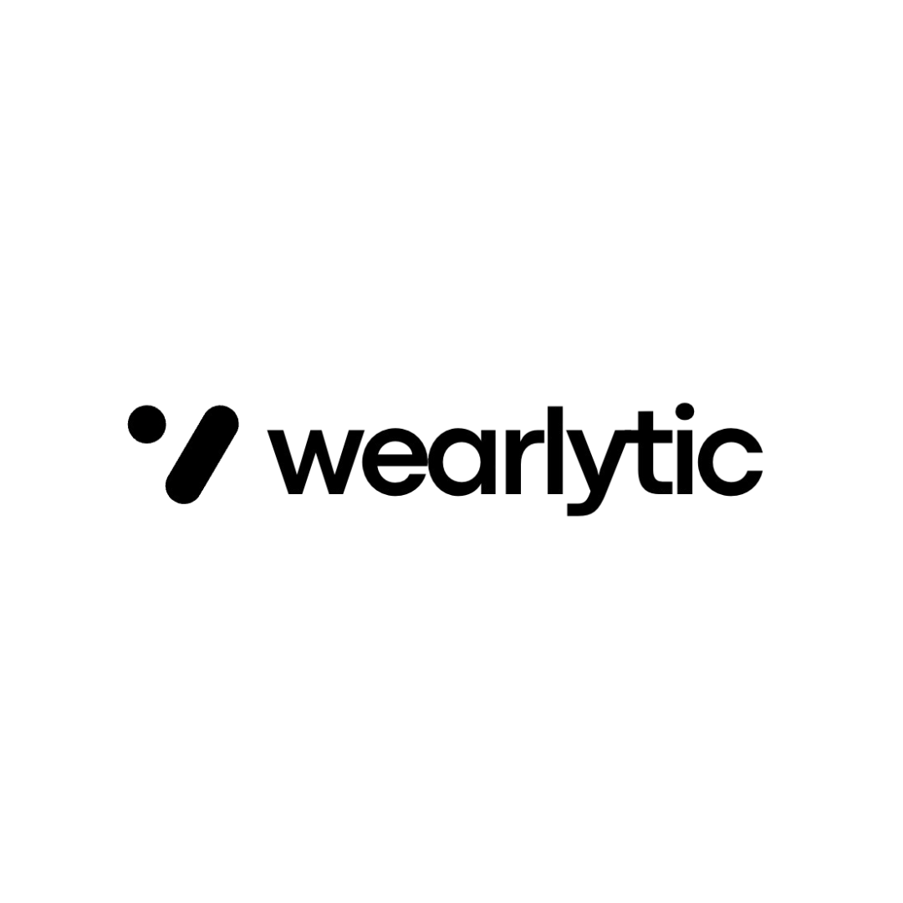

  

# Wearlytic

Wearlytic is a monorepo for fashion product discovery, scraping, ingestion, and AI-assisted outfit generation.

## Services

| Service | Tech | Responsibility | Local README |
| --- | --- | --- | --- |
| `web-app/` |    | React + Vite web app for authentication, product browsing, user profile management, and image-generation workflows. | [web-app/README.md](web-app/README.md) |
| `backend/` |    | Django REST API for users, products, categories, Supabase JWT authentication, storage integration, and image generation. | [backend/README.md](backend/README.md) |
| `scraping-agent/` |    | FastAPI + Celery service that runs website-specific product and listing scrapers. | [scraping-agent/README.md](scraping-agent/README.md) |
| `data-ingestor/` |    | FastAPI + Celery orchestration service for sources, listings, scrape batches, job status, and product warehouse ingestion. | [data-ingestor/README.md](data-ingestor/README.md) |

## Contribution Policy

This project currently accepts external pull requests only for adding or improving website scrapers in `scraping-agent/`.

Before opening a scraper PR:

1. Add the scraper implementation under `scraping-agent/scraperkit/scrapers/`.
2. Follow the existing scraper contracts and model shapes.
3. Add or update scraper tests under `scraping-agent/tests/`.
4. Run the relevant scraping-agent checks documented in [scraping-agent/README.md](scraping-agent/README.md).

Pull requests for `web-app/`, `backend/`, or `data-ingestor/` are not accepted unless maintainers explicitly request them.

## License

Wearlytic is released under the [Apache License 2.0](LICENSE).
