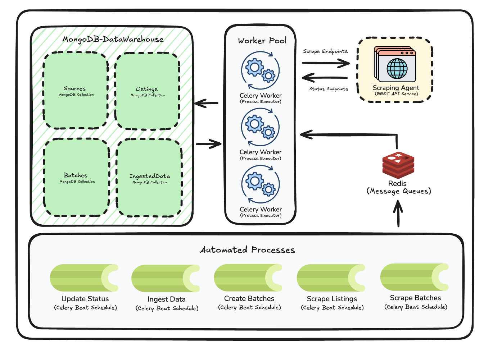

# CONTEXT.md

## Purpose of This File

This document is an AI-agent context file for the `data-ingestor` project. It is intended to give a future agent enough repository-specific context to:

- understand what the service does,
- find the real entrypoints quickly,
- reason about the data model and workflow,
- avoid leaking secrets,
- recognize the operational dependencies and unsafe assumptions,
- make changes without re-discovering the architecture from scratch.

This file is based on a repository scan performed on `2026-04-18`.

## Project Summary

`data-ingestor` is a FastAPI-based admin service for managing source/listing definitions and orchestrating a multi-step scraping pipeline. It is not the scraping engine itself. Instead, it:

- stores source and crawl metadata in MongoDB,
- schedules and triggers scraping jobs through a separate Scraping Agent service,
- tracks scrape job state in MongoDB,
- batches discovered product URLs,
- ingests completed product payloads into backend-owned PostgreSQL app tables,
- exposes a server-rendered admin dashboard for operators.

At runtime, this project depends on:

- FastAPI for HTTP/UI serving,
- MongoDB for workflow-state persistence,
- PostgreSQL for app product storage,
- Redis or Upstash Redis for Celery broker transport,
- Celery worker + Celery beat for asynchronous orchestration,
- an external Scraping Agent REST service for actual scraping.

## What This Service Is and Is Not

This service is:

- an orchestration and ingestion service,
- a small admin console,
- a Mongo-backed metadata layer with PostgreSQL product storage,
- a Celery scheduler/worker host.

This service is not:

- the scraper itself,
- a public JSON API,
- a typed or migration-backed data platform,
- a test-heavy codebase,
- a fully locked-down admin system.

## Repository Layout

Top-level files and directories that matter:

| Path | Role |
| --- | --- |
| `main.py` | Real FastAPI entrypoint. Defines `app`. |
| `app/routes/` | Route handlers for login, dashboard, source/listing management, and manual Celery triggers. |
| `app/db/` | MongoDB CRUD managers plus the PostgreSQL `ProductManager` for product writes. |
| `app/models/` | Pydantic models used to validate/create in-memory entities before insertion. |
| `app/celery_worker.py` | Celery app, task definitions, external Scraping Agent contract usage, beat schedule. |
| `app/templates/` | Jinja2 HTML templates for login and dashboard. |
| `app/static/` | CSS and logo used by the dashboard. |
| `app/utils/__init__.py` | Mongo connection singleton helpers. |
| `Makefile` | Operational commands for app, worker, beat, Redis, and Mongo lifecycle. |
| `requirements.txt` | Pinned Python dependencies. |
| `../assets/DATA-INGESTOR-ARCHITECTURE.png` | Shared data-ingestor architecture diagram used by README docs. |
| `README.md` | High-level architecture note and local setup guide. |
| `test.py` | Ad hoc script that imports Celery tasks and currently calls `fetch_results()` synchronously. |
| `static/image.png` | Legacy local copy of the architecture diagram. Prefer `../assets/DATA-INGESTOR-ARCHITECTURE.png` for docs. |
| `venv/` | Local virtual environment present in repo folder. Treat as environment state, not source code. |

Notes:

- `app/__init__.py` is effectively empty. Do not look there for the application object.
- `main.py` is the real app module used by Uvicorn.
- `app/templates/dashboard_template.html` looks like an older prototype template and is not wired to routes.

## Runtime Architecture

The effective runtime topology is:



1. Operator logs into the FastAPI admin dashboard.
2. Operator creates Sources and Listings in MongoDB.
3. Celery beat schedules periodic orchestration tasks.
4. Celery worker calls the external Scraping Agent for listing pages and product pages.
5. Scraping Agent returns asynchronous `job_id` values.
6. This service stores those jobs in a `Status` collection with `processing/completed/failed`.
7. Completed listing jobs produce `ProductUrl` records.
8. Unbatched `ProductUrl` records are grouped into `Batch` records.
9. Batch scraping triggers product-page jobs.
10. Completed product jobs upsert records into PostgreSQL `api_product` using URL as the idempotency key.

### Key Moving Parts

| Component | Responsibility |
| --- | --- |
| FastAPI app | Serves login page, dashboard, form POST endpoints, and manual trigger endpoints. |
| Session middleware | Keeps simple cookie-based admin session state. |
| MongoDB | Stores sources, listings, statuses, product URLs, and batches. |
| PostgreSQL | Stores product records in `api_category` and `api_product`. |
| Celery worker | Executes orchestration tasks and external API calls. |
| Celery beat | Schedules listing scrape, batch creation, batch scrape, and status polling. |
| Redis / Upstash | Celery broker transport. |
| Scraping Agent | External service that performs scraping and exposes scrape/status/result endpoints. |

## Real Entrypoints

### HTTP App

File: `main.py`

Important facts:

- Defines `app = FastAPI(title="DataIngestor API")`
- Adds `SessionMiddleware`
- Mounts `/static` from `./app/static`
- Includes routers from `app.routes`

The Uvicorn app module is:

```bash
main:app
```

### Celery App

File: `app/celery_worker.py`

Important facts:

- Defines the Celery application instance.
- Configures the Celery broker from `REDIS_URL`, falling back to local Redis.
- Registers all scheduled tasks.
- Contains all orchestration logic that talks to the Scraping Agent.

### Operational Command Layer

File: `Makefile`

This is the intended lifecycle interface for local development:

- `make run`
- `make stop`
- `make start-celery-beats`
- `make kill-celery-workers`
- `make start-redis`
- `make stop-redis`
- `make start-mongo`
- `make stop-mongo`
- `make test-scraping-agent`

## Detailed Module Map

### `main.py`

Main responsibilities:

- bootstraps FastAPI,
- sets session middleware,
- mounts static assets,
- loads routers.

Notable behavior:

- session secret is hard-coded in source, not loaded from environment.

### `app/routes/security.py`

Responsibilities:

- `/` redirect to login or dashboard depending on session,
- `GET /login` render login form,
- `POST /login` validate against env credentials,
- `GET /logout` and `POST /logout` clear session.

Behavior:

- stores `request.session["user"] = username` on successful login,
- uses Jinja2 templates from `./app/templates`.

### `app/routes/dashboard.py`

Responsibilities:

- `GET /dashboard`
- aggregates data from all Mongo managers,
- computes chart inputs,
- renders `dashboard.html`.

Data shown:

- sources,
- listings,
- statuses,
- product URLs,
- batches,
- total product count,
- status distribution bar chart,
- source distribution pie chart.

Dashboard display detail:

- product URLs are sliced to the first 100 records in the template.

### `app/routes/source.py`

Responsibilities:

- `POST /api/sources`
- `POST /api/sources/edit`
- `POST /api/sources/delete`

Behavior:

- all endpoints expect logged-in session state,
- create source from form data,
- editing a source cascades `active` status to all related listings,
- deleting a source deletes its listings first, then the source.

Important caveat:

- deleting a source does not clean up product URLs, statuses, batches, or products tied to those listings. Orphaned data is possible.

### `app/routes/listing.py`

Responsibilities:

- `POST /api/listings`
- `POST /api/listings/edit`
- `POST /api/listings/delete`

Behavior:

- create listing under a source,
- listing inherits the source's `active` state on creation,
- deleting a listing removes the listing reference from the source and deletes the listing document.

Important caveat:

- deleting a listing does not clean up `ProductUrl`, `Status`, `Batch`, or `Product` data derived from that listing.

### `app/routes/ingest.py`

Responsibilities:

- `POST /api/trigger-batch-scrape`
- `POST /api/trigger-batch-create`
- `POST /api/trigger-status-update`
- `POST /api/trigger-listing-scrape`

Behavior:

- dispatches Celery tasks with `.delay()`,
- redirects back to `/dashboard`.

Security caveat:

- these trigger endpoints do not perform their own session/auth check.
- the dashboard UI is login-gated, but the route handlers themselves are callable without explicit server-side auth validation.

### `app/routes/base.py`

Responsibilities:

- `GET /api`

This is the only clearly JSON-oriented route. Most other `/api/*` paths are form POST endpoints that redirect to HTML pages.

### `app/db/*`

These files are the effective persistence layer. There is no service layer above them except the Celery task logic and route handlers.

Common traits:

- each manager calls `get_db()` during `__init__`,
- managers are instantiated at module import time in route/task modules,
- all records are stored in MongoDB collections named by environment variables,
- most managers set both `id` and `_id` when inserting, but not all do so consistently.

### `app/models/*`

These are Pydantic schemas used for insertion/update object construction. They are useful for understanding intended document shape, but Mongo documents are still schemaless and may drift.

### `app/utils/__init__.py`

Responsibilities:

- create singleton `MongoClient`,
- expose singleton `get_db()`.

Behavior:

- always creates `MongoClient(..., tls=True, tlsCAFile=certifi.where(), serverSelectionTimeoutMS=5000)`.

Implication:

- switching to a plain local `mongodb://localhost:27017/` URI may require revisiting the TLS assumptions.

## Data Model

The service maintains five Mongo collections plus PostgreSQL app product tables.

### Collection Mapping

| Logical entity | Manager | Env var | Typical collection value in `.env` |
| --- | --- | --- | --- |
| Source | `SourceManager` | `SOURCES_COLLECTION_NAME` | `data_ingestor_sources` |
| Listing | `ListingsManager` | `LISTINGS_COLLECTION_NAME` | `data_ingestor_listings` |
| ProductUrl | `ProductUrlManager` | `PRODUCT_URLS_COLLECTION_NAME` | `data_ingestor_product_urls` |
| Status | `StatusManager` | `STATUS_COLLECTION_NAME` | `data_ingestor_process_status` |
| Batch | `BatchManager` | `BATCHES_COLLECTION_NAME` | `data_ingestor_batches` |
| Product | `ProductManager` | `DATABASE_URL` | backend PostgreSQL database |

### Source

Model fields:

| Field | Type | Meaning |
| --- | --- | --- |
| `id` | `str` | Application-level source identifier. |
| `listings` | `list[str]` | Listing IDs associated with the source. |
| `listing_count` | `int` | Cached count of associated listings. |
| `active` | `bool` | Whether source is active. |
| `name` | `str` | Admin-visible source name. |
| `created_at` | `datetime` | Source creation timestamp. |
| `base_url` | `str` | Root site URL. |

Relationships:

- one source has many listings,
- source stores listing IDs redundantly inside `listings`,
- `listing_count` is manually incremented/decremented.

### Listing

Model fields:

| Field | Type | Meaning |
| --- | --- | --- |
| `id` | `str` | Listing ID. |
| `source_id` | `str` | Parent source ID. |
| `last_listed` | `datetime \| null` | Last successful listing scrape time. |
| `url` | `str` | Listing page URL. |
| `active` | `bool` | Whether this listing is eligible for scrape selection. |

Key operational rule:

- `start_scraping_listing()` selects the oldest active listing per source.

### Status

Model fields:

| Field | Type | Meaning |
| --- | --- | --- |
| `id` | `str` | Status document ID. |
| `ingestion_type` | `listing` or `product` | What kind of job this tracks. |
| `job_id` | `str` | Scraping Agent job ID. |
| `status` | `processing`, `completed`, or `failed` | Current pipeline state. |
| `entity_id` | `str` | Listing ID or ProductUrl ID being tracked. |

Role:

- this is the only durable job-tracking collection owned by this service.

### ProductUrl

Model fields:

| Field | Type | Meaning |
| --- | --- | --- |
| `id` | `str` | Product URL ID. |
| `url` | `str` | Product page URL. |
| `source_id` | `str` | Parent source. |
| `listing_id` | `str` | Listing that discovered this URL. |
| `page_index` | `int` | Rank/index within listing output. |
| `batched` | `bool` | Whether it has been assigned to a batch. |
| `batch_id` | `str \| null` | Assigned batch ID. |

Key rule:

- deduplication is by `url`, not by source/listing composite key.

### Batch

Model fields:

| Field | Type | Meaning |
| --- | --- | --- |
| `id` | `str` | Batch ID. |
| `batch_size` | `int` | Cached batch size. |
| `urls` | `list[str]` | ProductUrl IDs in the batch. |
| `last_processed` | `datetime \| null` | Last time this batch was scraped. |

Important inconsistency:

- batch queries sort by `created_at`, but the `Batch` model does not define `created_at`, and new batches are not assigned one in `create_product_batches()`.

### Product

Model fields:

| Field | Type | Meaning |
| --- | --- | --- |
| `id` | `str` | Product ID returned by Scraping Agent. |
| `url_id` | `str` | ProductUrl document ID. |
| `title` | `str` | Product title. |
| `price` | `float` | Product price. |
| `url` | `str` | Product page URL. |
| `image_url` | `str` | Primary image URL. |
| `category` | `str \| null` | Product category. |
| `gender` | `Men`, `Women`, `Unisex`, or `null` | Target gender. |
| `colors` | `list[str]` | Color variants. |
| `size` | `list[str]` | Size variants. |
| `material` | `str \| null` | Material text. |
| `description` | `str \| null` | Description text. |
| `rating` | `float \| null` | Average rating. |
| `review_count` | `int` | Number of reviews. |
| `processed` | `bool` | Downstream processing flag. |
| `scraped_datetime` | `datetime \| null` | When it was scraped. |
| `processed_datetime` | `datetime \| null` | When downstream processing completed. |
| `page_index` | `int` | Rank from listing page. |
| `page_content` | `str \| null` | Raw scraped page content. |

Important behavioral note:

- new product writes do not use MongoDB.
- `ProductManager` upserts only `title`, `price`, `url`, `image_url`, and category into `api_product`.
- missing or blank categories are stored as `Uncategorized`.
- richer scrape fields remain ignored.

## End-to-End Workflow

### Workflow 1: Create Sources and Listings

1. Operator logs in.
2. Operator creates a Source from the dashboard.
3. Operator creates one or more Listings under that Source.
4. Listing inherits source `active` state.

### Workflow 2: Listing Scrape Orchestration

Task: `start_scraping_listing`

1. Check whether Scraping Agent is reachable.
2. Query Mongo for the oldest active listing per source.
3. For each selected listing, call Scraping Agent `scrape/` endpoint with:
   - `webpage_url`
   - `priority = "low"`
   - `type_page = "listing"`
4. On success, create a `Status` record with:
   - `ingestion_type = "listing"`
   - `status = "processing"`
   - `entity_id = listing.id`

### Workflow 3: Listing Result Ingestion

Task: `fetch_results`

When a listing job is `completed`:

1. Call Scraping Agent result endpoint.
2. Expect `result.items` from the response.
3. Update the listing `last_listed` timestamp.
4. For each returned item:
   - skip if product URL already exists by URL,
   - otherwise insert a `ProductUrl`.
5. Mark the `Status` record as `completed`.

Expected listing-result fields used by this service:

- `result.items`
- each item contains at least:
  - `url`
  - `page_rank`

### Workflow 4: Batch Creation

Task: `create_product_batches`

1. Query unbatched product URLs where `batched == False`.
2. Try to reuse an existing batch with free capacity.
3. Fill that batch first.
4. Create additional batches in chunks of `MAXIMUM_BATCH_SIZE`.
5. Mark affected `ProductUrl` records with:
   - `batched = True`
   - `batch_id = ...`

### Workflow 5: Product Scrape Orchestration

Task: `scrape_batch`

1. Check whether Scraping Agent is reachable.
2. Select top N batches via `get_top_n_batches(MAXIMUM_BATCHES_TO_PROCESS)`.
3. For each `ProductUrl` in each selected batch:
   - fetch `ProductUrl` document,
   - call Scraping Agent `scrape/` endpoint with:
     - `webpage_url`
     - `priority = "low"`
     - `type_page = "product"`
4. Create a `Status` record with:
   - `ingestion_type = "product"`
   - `status = "processing"`
   - `entity_id = product_url_id`
5. Update the batch `last_processed` timestamp after the loop.

### Workflow 6: Product Result Ingestion

Task: `fetch_results`

When a product job is `completed`:

1. Call Scraping Agent result endpoint.
2. Look up existing product by `result.id`.
3. If product exists:
   - update selected mutable fields only:
     - `price`
     - `colors`
     - `size`
     - `rating`
     - `review_count`
     - `scraped_datetime`
     - `page_content`
4. If product does not exist:
   - look up `ProductUrl` by `result.url`,
   - create a new `Product`.
5. Mark the `Status` row `completed` or `failed`.

Expected product-result fields used by this service:

- `result.id`
- `result.title`
- `result.price`
- `result.category`
- `result.gender`
- `result.url`
- `result.image_url`
- `result.colors`
- `result.size`
- `result.material`
- `result.description`
- `result.rating`
- `result.review_count`
- `result.scraped_datetime`
- `result.page_content`

## Celery Schedule

Timezone configuration:

- `Asia/Kolkata`
- `enable_utc = False`

Beat schedule:

| Task | Schedule |
| --- | --- |
| `start_scraping_listing` | daily at 07:00 IST |
| `start_scraping_listing` | daily at 19:00 IST |
| `create_product_batches` | daily at 08:00 IST |
| `create_product_batches` | daily at 20:00 IST |
| `scrape_batch` | daily at 09:00 IST |
| `scrape_batch` | daily at 21:00 IST |
| `fetch_results` | every 900 seconds |

Celery queue configuration:

- default queue: `data_ingestor_queue`
- worker command in Makefile uses:
  - queue `data_ingestor_queue`
  - pool `solo`
  - concurrency `1`

Broker transport option:

- polling interval is set to `180`

## External Scraping Agent Contract

This code assumes a separate Scraping Agent service with these effective endpoints:

| Method | Path shape | Purpose |
| --- | --- | --- |
| `GET` | base endpoint from `SCRAPING_AGENT_API_URL` | health/reachability check |
| `POST` | `scrape/` | create scrape job |
| `GET` | `scrape/{job_id}/status/` | fetch job status |
| `GET` | `scrape/{job_id}/result/` | fetch job result payload |

Headers used:

- `Authorization: Bearer <SCRAPING_AGENT_TOKEN>`
- `Content-Type: application/json`

The code constructs URLs with `build_scraping_agent_url()`, so endpoint configuration should omit or tolerate trailing slashes.

## HTTP Surface

### Browser/Admin Routes

| Method | Route | Notes |
| --- | --- | --- |
| `GET` | `/` | Redirects to `/dashboard` if session exists, else `/login`. |
| `GET` | `/login` | Login form. |
| `POST` | `/login` | Validates env credentials, sets session. |
| `GET` | `/logout` | Clears session. |
| `POST` | `/logout` | Clears session. |
| `GET` | `/dashboard` | Main admin console. |

### Data/Action Routes

| Method | Route | Notes |
| --- | --- | --- |
| `GET` | `/api` | Small JSON endpoint index. |
| `POST` | `/api/sources` | Create source from form. |
| `POST` | `/api/sources/edit` | Edit source from form. |
| `POST` | `/api/sources/delete` | Delete source. |
| `POST` | `/api/listings` | Create listing from form. |
| `POST` | `/api/listings/edit` | Edit listing. |
| `POST` | `/api/listings/delete` | Delete listing. |
| `POST` | `/api/trigger-batch-scrape` | Enqueue batch scrape. |
| `POST` | `/api/trigger-batch-create` | Enqueue batch creation. |
| `POST` | `/api/trigger-status-update` | Enqueue polling. |
| `POST` | `/api/trigger-listing-scrape` | Enqueue listing scrape. |

Important framing:

- despite the `/api` prefix, most of these endpoints are form handlers that redirect rather than return JSON.
- because this is FastAPI, default docs endpoints may still exist unless disabled elsewhere.

## Dashboard / UI Behavior

The dashboard is server-rendered Jinja2 plus CDN-hosted Bootstrap, Bootstrap Icons, and Chart.js.

Visual sections:

- status table,
- status distribution chart,
- source distribution pie chart,
- sources list with create/edit/delete,
- listings list with create/edit/delete,
- product URL list,
- batches list,
- manual buttons for:
  - status refresh,
  - listing scrape,
  - batch creation,
  - batch scrape.

UI implementation notes:

- copy-to-clipboard helpers are implemented in inline JavaScript.
- charts are built from server-supplied arrays serialized with `tojson`.
- assets are loaded from CDNs, so dashboard rendering assumes external network access in the browser.

## Environment Contract

This repo contains a `.env` file with real-looking credentials/tokens. Do not copy secret values into docs, logs, commits, prompts, or patches.

### Required Environment Variables

| Variable | Role |
| --- | --- |
| `SCRAPING_AGENT_API_URL` | Base URL for external Scraping Agent. |
| `SCRAPING_AGENT_TOKEN` | Bearer token for Scraping Agent. |
| `REDIS_URL` | Optional Celery broker URL. Falls back to `redis://localhost:6379/0` when unset. |
| `MAXIMUM_BATCH_SIZE` | Max URLs per batch. Parsed at import time. |
| `MAXIMUM_BATCHES_TO_PROCESS` | Number of batches to scrape per run. Parsed at import time. |
| `ADMIN_USERNAME` | Login username for admin UI. |
| `ADMIN_PASSWORD` | Login password for admin UI. |
| `MONGO_URI` | MongoDB connection string. |
| `MONGO_DBNAME` | Mongo database name. |
| `DATABASE_URL` | Backend PostgreSQL connection URL for `api_category` and `api_product`. |
| `SOURCES_COLLECTION_NAME` | Source collection name. |
| `LISTINGS_COLLECTION_NAME` | Listing collection name. |
| `PRODUCT_URLS_COLLECTION_NAME` | Product URL collection name. |
| `STATUS_COLLECTION_NAME` | Status collection name. |
| `BATCHES_COLLECTION_NAME` | Batch collection name. |
| `PRODUCTS_COLLECTION_NAME` | Legacy Mongo product collection name; not used for new product writes. |
### Env Behavior Notes

- `load_dotenv()` is called in many modules at import time.
- several values are parsed immediately on import, not lazily.
- missing or malformed env values can fail imports before the app fully starts.

### Important Configuration Mismatch

The checked-in `.env` currently indicates:

- local Redis fallback when `REDIS_URL` is unset,
- but Mongo URI points to a hosted Atlas cluster, not obviously local MongoDB.

This matters because:

- `make run` starts local Mongo and Redis through Homebrew,
- but the application may still talk to hosted Mongo unless `MONGO_URI` is changed.

## Dependency Snapshot

Primary runtime dependencies:

- `fastapi`
- `uvicorn`
- `pymongo`
- `python-dotenv`
- `celery`
- `redis`
- `requests`
- `Jinja2`
- `starlette`

UI libraries loaded at runtime from CDN:

- Bootstrap 5
- Bootstrap Icons
- Chart.js

Observations:

- `fastapi-sessions` is present in `requirements.txt` but the app uses Starlette session middleware directly.

## Local Development and Operations

### Expected Run Path

Typical local sequence:

```bash
make run
```

What `make run` does:

1. starts Redis via Homebrew if available,
2. starts Mongo via Homebrew if available,
3. starts Celery worker and Celery beat,
4. starts Uvicorn with reload on port `8081`.

### Important Operational Files

Generated/managed state in repo root may include:

- `.uvicorn_pid`
- `.celery_worker_pid`
- `.celery_beat_pid`
- `celerybeat-schedule.db`
- `__pycache__/`

`make stop`:

- stops worker, beat, Redis, Mongo,
- stops Uvicorn,
- removes Python cache directories.

### Ad Hoc Script

File: `test.py`

Current behavior:

- imports Celery task functions directly,
- currently calls `fetch_results()` synchronously,
- bypasses Celery queue semantics.

Treat this as a manual debugging script, not a real automated test.

## Import-Time Side Effects

This codebase has significant import-time behavior. Be careful when refactoring module boundaries.

Examples:

- DB managers are instantiated as module globals in routes and tasks.
- `.env` is loaded in many modules.
- Celery configuration reads env values at import time.
- integer parsing for batch settings happens immediately.
- Mongo client singleton is initialized on first manager creation.

Implication for agents:

- moving imports can change startup behavior,
- tests that import modules may accidentally attempt DB access,
- missing env vars can break imports instead of only runtime paths.

## Known Quirks, Risks, and Inconsistencies

These are important for future modification work.

### Security / Exposure

- Session middleware secret is hard-coded in `main.py`, not env-driven.
- Trigger endpoints in `app/routes/ingest.py` do not check session state.
- `.env` contains plaintext secrets and should be treated as sensitive.

### Data Integrity

- Deleting sources/listings can leave orphaned product URLs, statuses, batches, and products.
- Referential integrity is manual and partial.
- There are no Mongo indexes or migrations defined in code.

### Batch Model Drift

- `BatchManager` sorts on `created_at`, but `Batch` documents are not clearly created with `created_at`.
- batch selection order may therefore be unstable or dependent on absent fields.

### Product Update Scope

- Existing app products are refreshed by URL.
- Only `title`, `price`, `image_url`, and category are updated in `api_product`.
- Rich scrape fields are intentionally out of scope.

### ProductUrl Lookup Mismatch

- `ProductUrlManager.get_product_url_by_url()` projects only `id`.
- Product writes no longer depend on `page_index`, but future workflow metadata changes should account for this projection.

### Manager Oddities

- `SourceManager` includes `get_status_by_ingestion_type()` and `get_status_by_status()`, which appear copied from `StatusManager` and operate on the sources collection. These look unused and misleading.
- batch insertion does not mirror the `_id` assignment pattern used by most other managers.

### UI / Frontend Bug

- dashboard inline JS for the edit-listing modal references `modalSourceSelect` and `sourceId` without defining them in the shown code path, which likely causes a browser-side error when the modal opens.

### Testing Gaps

- there is no real automated test suite,
- no `pytest`-style tests were found,
- `test.py` is an imperative helper, not a safety net.

## Agent Guidance

If you are an AI agent modifying this repo, these heuristics will save time.

### Safe Starting Reads

Start with:

1. `main.py`
2. `app/celery_worker.py`
3. `app/routes/dashboard.py`
4. the relevant `app/db/*.py` manager
5. the relevant `app/models/*.py` schema
6. `Makefile`

### If You Need to Change Data Flow

Check all of:

- route handler,
- manager method,
- corresponding model,
- dashboard template expectations,
- Celery task that creates or consumes that entity.

There is no centralized domain service layer. Logic is spread across routes, managers, and Celery tasks.

### If You Need to Change Scheduling

Edit:

- `app/celery_worker.py`

And verify:

- queue name,
- task names,
- beat schedule,
- local `Makefile` startup commands.

### If You Need to Change Persistence

Check:

- env collection name,
- manager insert/update logic,
- whether `_id` is explicitly set,
- any cached counters or denormalized arrays,
- delete/cascade implications.

### If You Need to Change Authentication

Relevant files:

- `main.py`
- `app/routes/security.py`
- `app/routes/ingest.py`
- `app/templates/login.html`

Remember:

- session secret is not centralized in env,
- trigger endpoints currently bypass auth checks.

### If You Need to Change UI

Relevant files:

- `app/routes/dashboard.py`
- `app/templates/dashboard.html`
- `app/static/css/dashboard.css`
- `app/templates/login.html`

Remember:

- template includes inline JavaScript,
- chart data is server-computed,
- product URL panel intentionally limits rendered items.

## Things Not Present in This Repo

Future agents should not waste time looking for these unless they are added later:

- Alembic or migration tooling,
- pytest suite,
- Docker setup,
- CI workflow files in this folder,
- typed settings/config layer,
- repository pattern beyond the simple Mongo managers,
- separate service layer for business logic,
- real API versioning,
- background job retry policy customization,
- public OpenAPI contracts for the ingestion pipeline beyond what FastAPI auto-generates.

## Recommended Mental Model

Treat this project as:

- a thin admin UI,
- a thin Mongo CRUD layer,
- a Celery orchestration layer,
- a dependency on a separate scraper service.

When debugging failures, the usual fault lines are:

1. environment configuration,
2. Scraping Agent availability/response shape,
3. Mongo document drift,
4. batch-selection logic,
5. missing cleanup/cascade behavior,
6. import-time side effects.

## Quick Start for a New Agent

If you need to become productive quickly:

1. Read `main.py` and `app/celery_worker.py`.
2. Read the relevant manager in `app/db/`.
3. Read the corresponding route in `app/routes/`.
4. Check `.env` names but do not copy secret values.
5. Verify whether your change affects:
   - dashboard rendering,
   - Celery schedule,
   - Mongo schema,
   - Scraping Agent payload/response assumptions.

That is the minimum path to make a coherent change safely in this repo.
