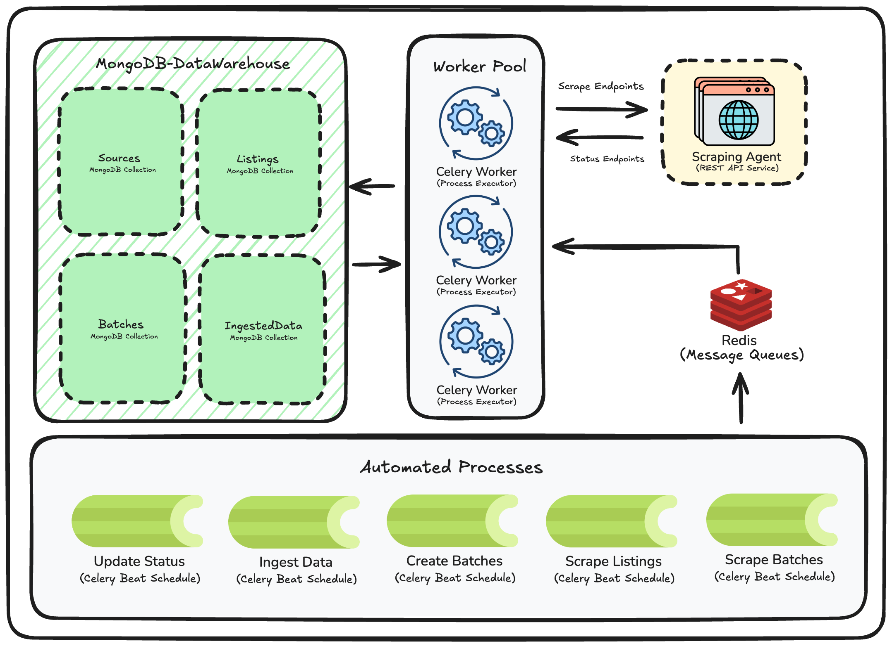

# Data Ingestor

## Main Components

- **main.py**: FastAPI app entry point.
- **app/**: Core application logic and structure.
  - `routes/`: API endpoints for dashboard, ingestion, listings, sources, and security.
  - `models/`: Data models for batches, listings, products, sources, and status.
  - `db/`: Database operations and data access layer.
- **celery_worker.py**: Celery background task definitions for data processing.
- **requirements.txt**: Python dependencies.
- **Makefile**: Commands to run, stop, and manage the service.

###  Architecture Overview

The Data Ingestor microservice is designed as an **automated data scraping and warehousing system**.  

- **MongoDB Data Warehouse**  
  Stores all relevant collections:
  - **Sources**: Metadata about each data source.
  - **Listings**: URLs and configurations for scraping.
  - **Batches**: Organized groups of scraping tasks.
  - **IngestedData**: Scraped product details stored for analysis.

- **Worker Pool (Celery Workers)**  
  Executes scraping and data processing tasks asynchronously. Workers process jobs from the message queue, enabling scalability and fault tolerance.

- **Scraping Agent**  
  A dedicated REST API service that fetches and parses product listings from source URLs. It communicates with the worker pool through defined scrape and status endpoints.

- **Redis (Message Queue)**  
  Acts as a broker for distributing tasks to Celery workers and tracking job status.

- **Automated Processes (Celery Beat Schedule)**  
  Key scheduled jobs include:
  - **Update Status**: Periodically checks the status of scraping jobs.
  - **Ingest Data**: Processes and stores newly scraped data.
  - **Create Batches**: Groups listings into batches for efficient scraping.
  - **Scrape Listings**: Triggers scraping for defined listing URLs.
  - **Scrape Batches**: Processes entire batches of listings.

This architecture ensures the system is **scalable, automated, and maintainable**, allowing admins to focus solely on defining sources and listings while the microservice handles all scraping, processing, and storage tasks.

