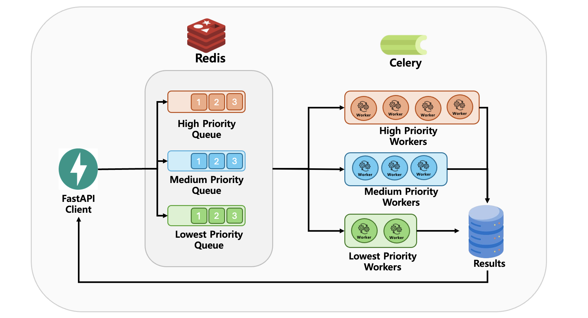
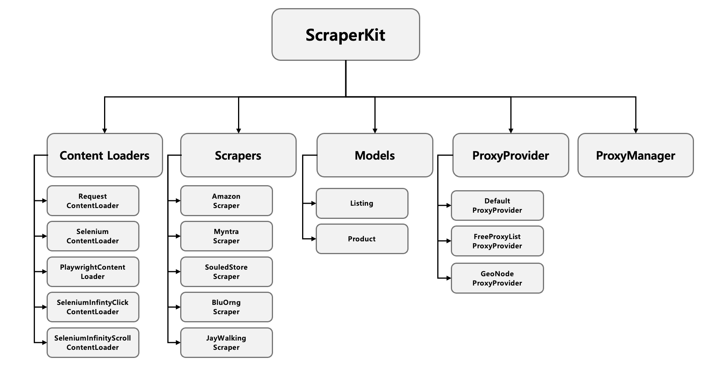
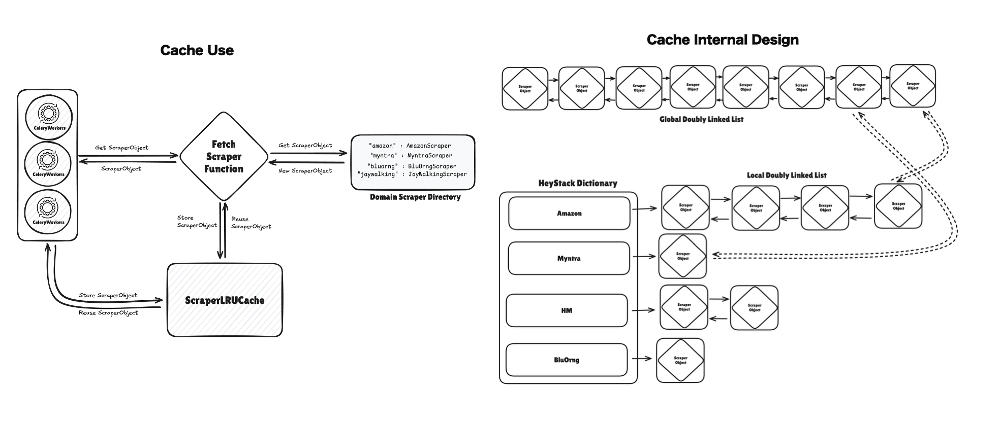

# CONTEXT.md

## Purpose

This file is a repo-native working context for AI agents that need to read, modify, extend, test, or debug this project.

This project is a Python web-scraping service with:

- a FastAPI HTTP layer
- a Celery async execution layer
- MongoDB persistence for job metadata and job results
- Redis or Upstash Redis as the Celery broker
- a `scraperkit` package that contains the actual scraping framework, loaders, scrapers, exceptions, and utility code
- a test suite that mixes unit tests with live integration tests against real websites

The project is oriented around scraping either:

- a listing page -> returning a list of product URLs with page rank
- a product page -> returning a structured product payload

## High-Level Snapshot

### Current supported source websites

The scraper registry currently supports these domains:

- `amazon` -> `AmazonScraper`
- `myntra` -> `MyntraScraper`
- `bluorng` -> `BluOrngScraper`
- `jaywalking` -> `JayWalkingScraper`
- `thesouledstore` -> `SouledStoreScraper`

These mappings live in `scraperkit/__init__.py`.

### Core runtime flow

1. A client sends `POST /api/scrapingagent/scrape` with:
   - `webpage_url`
   - `priority`
   - `type_page` (`listing` or `product`)
2. FastAPI verifies a bearer token from `API_ACCESS_TOKEN`.
3. The route enqueues a Celery task to one of three queues:
   - `scraping_agent_scrape_low`
   - `scraping_agent_scrape_medium`
   - `scraping_agent_scrape_high`
4. The route also writes a `Job` document to MongoDB with status `queued`.
5. A Celery worker picks up the task, updates the Mongo job to `processing`, resolves a scraper from the target URL, and performs the scrape.
6. On success:
   - a `JobResult` document is written to Mongo
   - the original `Job` document is updated to `completed`
7. On failure:
   - a failed `JobResult` is still written
   - the original `Job` is updated to `failed`
8. API status/result endpoints read only from MongoDB, not from Celery state.

### Important architectural split

There are two separate `Product` models:

- `scraperkit.models.Product`
  - used by scraper implementations
  - intentionally permissive and scraper-facing
- `api.models.Product`
  - used for API result validation / coercion
  - stricter and more API-facing

Celery tasks usually scrape into `scraperkit.models.Product`, convert to JSON with `model_dump(mode="json")`, then rely on `api.models.JobResult` to coerce the payload back into API-side models.

## Repository Layout

### Top-level files

- `main.py`
  - FastAPI entrypoint.
- `Makefile`
  - local dev orchestration for Redis, MongoDB, Celery workers, venv setup, and tests.
- `requirements.txt`
  - runtime dependencies.
- `requirements-dev.txt`
  - currently only `pytest`.
- `pytest.ini`
  - test roots and markers.
- `README.md`
  - high-level docs, but partially out of date.
- `TODO.md`
  - short planning note with future cleanup ideas.
- `CONTEXT.md`
  - this file.

### API package

- `api/routes/base.py`
  - root redirect and lightweight base endpoint.
- `api/routes/scrape.py`
  - job creation endpoint.
- `api/routes/status.py`
  - job status and job result retrieval endpoints.
- `api/routes/__init__.py`
  - router exports.
- `api/celery_worker.py`
  - Celery app setup and both scraping tasks.
- `api/security/__init__.py`
  - bearer token validation.
- `api/db/job.py`
  - Mongo CRUD wrapper for jobs.
- `api/db/job_results.py`
  - Mongo CRUD wrapper for job results.
- `api/db/__init__.py`
  - DB manager exports.
- `api/models/job.py`
  - `JobRequest`, `Job`, `JobResult`.
- `api/models/listing.py`
  - `ListingItem`, `Listing`.
- `api/models/product.py`
  - API-facing `Product`.
- `api/models/__init__.py`
  - model imports / exports.

### Scraper framework package

- `scraperkit/base/base_content_loader.py`
  - abstract loader interface.
- `scraperkit/base/base_scraper.py`
  - abstract scraper interface plus shared state.
- `scraperkit/loaders/request_content_loader.py`
  - requests-based loader.
- `scraperkit/loaders/selenium_content_loader.py`
  - Selenium Chrome loader.
- `scraperkit/loaders/playwright_content_loader.py`
  - Playwright Chromium loader.
- `scraperkit/loaders/selenium_infinity_scroll_content_loader.py`
  - Selenium loader for infinite-scroll pages.
- `scraperkit/exceptions/*.py`
  - custom exception taxonomy for scraping and content loading.
- `scraperkit/models/product.py`
  - scraper-facing `Product`.
- `scraperkit/utils/__init__.py`
  - domain extraction, scraper resolution, driver path lookup, global cache instance.
- `scraperkit/utils/scraper_lru_cache.py`
  - custom per-source/global LRU cache for scraper instances.
- `scraperkit/scrapers/amazon_scraper.py`
  - Amazon India implementation.
- `scraperkit/scrapers/myntra_scraper.py`
  - Myntra implementation.
- `scraperkit/scrapers/bluorng_scraper.py`
  - BluOrng implementation.
- `scraperkit/scrapers/jaywalking_scraper.py`
  - JayWalking implementation.
- `scraperkit/scrapers/souled_store_scraper.py`
  - The Souled Store implementation.
- `scraperkit/drivers/...`
  - bundled ChromeDriver binaries for multiple platforms.

### Tests

- `tests/base/test_base_contracts.py`
  - verifies abstract base behavior and exception inheritance.
- `tests/loaders/*.py`
  - live integration tests for content loaders.
- `tests/utils/test_utils.py`
  - tests for URL-to-domain resolution, scraper lookup, and driver path selection.
- `tests/utils/test_scraper_lru_cache.py`
  - tests the custom cache behavior.
- `tests/scrapers/test_scrapers.py`
  - live end-to-end scraper tests against real websites.
- `tests/scrapers/scrape_artifact_logger.py`
  - logs HTML snapshots and JSON summaries for live scraper runs.
- `tests/scrapers/test_scrape_artifact_logger.py`
  - unit tests for artifact logging.
- `tests/artifacts/scraper_runs/...`
  - stored outputs from real integration runs dated `2026-04-16`.

## Actual Runtime Architecture

### FastAPI app

`main.py` creates one `FastAPI(title="ScrapingAgent API")` app and includes three routers:

- `IndexRouter`
- `ScrapeRouter`
- `StatusRouter`

There is no versioning layer, no dependency injection container, and no lifespan logic.

### API routes

#### `api/routes/base.py`

Behavior:

- `GET /`
  - redirects to `/api/scrapingagent/`
- `GET /api/scrapingagent/`
  - returns a simple JSON object describing endpoints

Important note:

- The returned endpoint descriptions are stale and inconsistent with the real route prefixes.
- It advertises `/api/scrape/...` and even contains a typo: `/api/scraper/{task_id}/result/`.
- The actual prefix everywhere else is `/api/scrapingagent/scrape`.

#### `api/routes/scrape.py`

Behavior:

- Defines `POST /api/scrapingagent/scrape`
- Requires bearer auth via `Depends(verify_token)`
- Accepts `JobRequest`
- Re-validates `priority` and `type_page` manually even though Pydantic already constrains them
- Enqueues:
  - `scrape_product_task` for `type_page == 'product'`
  - `scrape_listing_task` for `type_page == 'listing'`
- Writes an initial `Job` to Mongo with:
  - `status='queued'`
  - `created_at=datetime.now()`
- Returns `{"job_id": task.id}`

Important notes:

- Invalid `priority` and `type_page` raise `HTTPException(status_code=404)` instead of `400`.
- Because `JobRequest` already uses `Literal[...]`, FastAPI will normally reject invalid values before this manual validation runs.
- The route instantiates `JobsManager()` at import time.

#### `api/routes/status.py`

Behavior:

- `GET /api/scrapingagent/scrape/{task_id}/status/`
  - fetches a job document from Mongo
- `GET /api/scrapingagent/scrape/{task_id}/result/`
  - fetches a job result document from Mongo

Important notes:

- Both endpoints require bearer auth.
- Both use very broad `try/except Exception` blocks and convert every failure to `404`.
- This hides real operational errors such as Mongo connectivity issues.
- The function names are `get_listing_status` and `get_listing_result`, but they are generic for both listing and product jobs.

### Security

`api/security/__init__.py` uses `fastapi.security.HTTPBearer`.

Behavior:

- expects `Authorization: Bearer <token>`
- compares token to `API_ACCESS_TOKEN` from environment
- raises `403` on mismatch

Notes:

- There is no optional auth mode, no role system, and no token rotation logic.
- If `API_ACCESS_TOKEN` is unset, every non-empty token comparison will fail unless the incoming token is also `None`-like, which `HTTPBearer` does not provide.

### Celery layer

All Celery code is in `api/celery_worker.py`.

#### Broker selection

Environment behavior:

- reads `REDIS_URL` from the environment
- if `REDIS_URL` is unset or blank, broker falls back to `redis://localhost:6379/0`
- Docker, Upstash, and other Redis providers should be configured by setting the full connection URL in `REDIS_URL`

#### Celery configuration

- app name: `scrapingagent`
- backend: `rpc://`
- queues:
  - `scraping_agent_scrape_high`
  - `scraping_agent_scrape_medium`
  - `scraping_agent_scrape_low`
- default queue:
  - `scraping_agent_scrape_medium`
- broker transport options:
  - `{'polling_interval': 60}`

#### Listing task: `scrape_listing_task`

Core algorithm:

1. Instantiate `JobsManager` and `JobResultsManager`.
2. Read `job_id` from `self.request.id`.
3. If URL is empty:
   - mark job failed
   - return failure string
4. Update Mongo job status to `processing`.
5. Resolve:
   - `domain = extract_domain(url)`
   - `scraper = get_scraper_from_url(url)`
6. Iterate pagination:
   - start at `current_url = url`
   - `page_rank = 1`
   - `page_count = 0`
   - hard stop at `max_pages = 30`
7. For each page:
   - call `scraper.get_pagination_details(current_url)`
   - call `scraper.get_product_listings(current_url, pagination.get("current_page"))`
   - convert each listing URL into `ListingItem(url=..., page_rank=...)`
   - stop when `next_page_url` is missing or equals current URL
8. Build `Listing(items=items)`.
9. Persist `JobResult(... status="completed" ...)`.
10. Update `Job.status` to `completed`.
11. Insert scraper instance back into the global cache under the domain key.

Failure path:

- creates a failed `JobResult` with `Listing(items=[])`
- updates job to `failed`
- returns a plain string

Important behavioral notes:

- `get_product_listings()` receives `pagination.get("current_page")` as the `page` argument, which only matters for scrapers that use it.
- Pagination termination relies entirely on scraper-provided `next_page_url`.
- There is no deduplication at the Celery task level; deduplication is scraper-specific.
- Success and failure timestamps use `datetime.now()` without timezone.

#### Product task: `scrape_product_task`

Core algorithm:

1. Instantiate DB managers.
2. Validate non-empty URL.
3. Update job to `processing`.
4. Resolve domain and scraper.
5. Call `scraper.get_product_details(product_page_url=url)`.
6. Convert the returned scraper product to JSON with `model_dump(mode="json")`.
7. Persist an API-side `JobResult`.
8. Update job to `completed`.
9. Cache the scraper object by domain.

Failure path:

- creates a failed `JobResult` with `result={}`
- updates job to `failed`

Important behavioral notes:

- Product results are written as dicts, not `scraperkit.models.Product` objects.
- `api.models.JobResult` is responsible for coercing that dict into the API-side `Product`.

## Persistence Model

### Mongo collections

Defined in both `api/db/job.py` and `api/db/job_results.py`:

- jobs collection: `scraping_agent_jobs`
- results collection: `scraping_agent_job_results`

### `JobsManager`

Responsibilities:

- `create_job(job: Job)`
- `update_job(job_id: str, updates: dict)`
- `get_job(job_id: str)`
- `delete_job(job_id: str)`

Behavior:

- Each instance creates a new `MongoClient(MONGO_URI)` and binds to `db[MONGO_DBNAME]`.
- On insert:
  - `job.model_dump(mode="json")`
  - adds `_id = job_id`

### `JobResultsManager`

Responsibilities:

- `create_result(result: JobResult)`
- `update_result(job_id: str, updates: dict)`
- `get_result(job_id: str)`
- `delete_result(job_id: str)`

Behavior mirrors `JobsManager`.

### Persistence design notes

- Mongo `_id` is explicitly set to the same value as `job_id`.
- The managers are thin wrappers with no retries, no index management, and no connection lifecycle management.
- Insert operations will fail if the same `job_id` is written twice.
- Returned documents are raw Mongo dicts.
- `_id` is a string, so FastAPI can serialize it without `ObjectId` issues.

## Data Models

### `api.models.JobRequest`

Fields:

- `webpage_url: AnyHttpUrl`
- `priority: Literal['high', 'medium', 'low'] = 'low'`
- `type_page: Literal['listing', 'product']`

### `api.models.Job`

Fields:

- `job_id: str`
- `webpage_url: AnyHttpUrl`
- `priority`
- `type_page`
- `status: Literal['queued', 'processing', 'completed', 'failed']`
- `created_at: datetime`
- `completed_at: Optional[datetime]`
- `error_message: Optional[str]`

### `api.models.JobResult`

Fields:

- `job_id: str`
- `result: Union[Product, Listing, list[Product], list[Listing]]`
- `status: Literal['completed', 'failed']`
- `completed_at: datetime`
- `error_message: Optional[str]`

Important note:

- In practice this model is also used with raw dict payloads, relying on Pydantic coercion.

### `api.models.ListingItem`

Fields:

- `url: AnyHttpUrl`
- `page_rank: float >= 0`

### `api.models.Listing`

Fields:

- `items: List[ListingItem]`

### `api.models.Product`

This is the API-facing product schema. Most fields are required here:

- required:
  - `id`
  - `title`
  - `price`
  - `category`
  - `url`
  - `image_url`
  - `sizes`
  - `description`
  - `page_content`
- optional:
  - `gender`
  - `colors`
  - `material`
  - `rating`
  - `review_count`
  - `scraped_datetime`
  - `processed_datetime`
  - `page_index`
- `processed` defaults to `False`

### `scraperkit.models.Product`

This is the scraper-facing schema and is intentionally easier for scrapers to satisfy.

Required here:

- `id`
- `title`
- `price`
- `description`
- `url`
- `image_url`

Everything else is optional or defaulted.

### Why the split matters

Future agents must remember:

- scraper code should usually return `scraperkit.models.Product`
- API and Celery result persistence use `api.models.JobResult`
- changes to one `Product` model can silently break the other side

## Scraper Framework

### `BaseContentLoader`

Defines:

- default browser-like headers
- default timeout `10`
- abstract `load_content(page_url)`

### `BaseScraper`

Defines:

- `base_url`
- `headers`
- `content_loader`
- `current_page_content = None`
- `current_product_page_content = None`

Public abstract methods:

- `get_page_content`
- `get_pagination_details`
- `get_product_listings`
- `get_product_details`

Protected extractor methods:

- `_extract_id`
- `_extract_title`
- `_extract_category`
- `_extract_price`
- `_extract_sizes`
- `_extract_description`
- `_extract_material`
- `_extract_image_url`
- `_extract_gender`
- `_extract_colors`
- `_extract_rating`
- `_extract_review_count`

Important note:

- These protected extractor methods are stubbed with `pass`, but they are not marked `@abstractmethod`.
- The public scrape methods are abstract and enforce the real contract.

### Exception taxonomy

Custom exceptions in `scraperkit/exceptions`:

- `BadURLException`
- `ContentNotLoadedException`
- `DataComponentNotFoundException`
- `DataParsingException`
- `RateLimitException`
- `TimeoutException`
- `DriverNotInitializedException`

Typical intended meaning:

- bad input or invalid navigation -> `BadURLException`
- page fetch failed -> `ContentNotLoadedException`
- selector missing / structure changed -> `DataComponentNotFoundException`
- found component but failed to parse -> `DataParsingException`
- browser setup failed -> `DriverNotInitializedException`

## Loader Layer

### `RequestContentLoader`

Mechanics:

- plain `requests.get(...)`
- wraps:
  - timeout -> `TimeoutException`
  - invalid URL / connection issues -> `BadURLException`
  - HTTP errors -> `ContentNotLoadedException`
  - anything else -> `ContentNotLoadedException`

Best use:

- simple static pages

### `SeleniumContentLoader`

Mechanics:

- uses bundled ChromeDriver via `get_driver_path()`
- launches `webdriver.Chrome`
- applies multiple anti-automation-ish Chrome flags
- sets `page_load_strategy = 'eager'`
- waits for `<body>`
- then sleeps for 10 seconds before reading `page_source`

Important details:

- `ChromeDriverManager` is imported but not used.
- If driver init fails, constructor raises `DriverNotInitializedException`.
- A `<pre>` tag containing "not found" is treated as a `BadURLException`.
- `close()` quits the driver and stops the service.

Best use:

- JS-heavy pages that still stabilize with a simple wait.

### `PlaywrightContentLoader`

Mechanics:

- starts sync Playwright
- launches Chromium
- uses `page.goto(..., wait_until="load")`
- returns `page.content()`

Error mapping:

- Playwright timeout -> `TimeoutException`
- `ValueError` -> `BadURLException`
- Playwright error -> `ContentNotLoadedException`

### `SeleniumInfinityScrollContentLoader`

Mechanics:

- Selenium Chrome via bundled driver
- repeatedly scrolls until:
  - target element class is found and scrolled into view, or
  - it falls back to `window.scrollTo(...)`
- stops when document height stops increasing or when `max_scrolls` is reached

Configurable parameters:

- `headers`
- `max_scrolls`
- `headless`
- `target_class_name`
- `scroll_delay`

Best use:

- collection/listing pages that lazy-load more items while scrolling

Important note:

- This loader does not verify that the target class is present across the whole run.
- If `target_class_name` is wrong, it falls back to coarse scrolling behavior.

## Utility Layer

### `extract_domain(url)`

Behavior:

- strips `www.`
- splits host by `.`
- returns the second-to-last segment

Examples:

- `amazon.in` -> `amazon`
- `www.myntra.com` -> `myntra`
- `www.thesouledstore.com` -> `thesouledstore`

### `get_scraper_from_url(url)`

Behavior:

1. imports `SCRAPER_URL_MAP`
2. derives the domain key using `extract_domain(url)`
3. checks the global cache first
4. if cached scraper exists:
   - returns the cached scraper
   - and removes it from the cache in the process
5. otherwise instantiates a new scraper class
6. if the domain is unsupported, raises `BadURLException`

### `get_driver_path()`

Uses `PLATFORM` env var and returns one of:

- `./scraperkit/drivers/chromedriver-mac-arm64/chromedriver`
- `./scraperkit/drivers/chromedriver-mac-x64/chromedriver`
- `./scraperkit/drivers/chromedriver-win64/chromedriver.exe`
- `./scraperkit/drivers/chromedriver-linux64/chromedriver`

Important note:

- If `PLATFORM` is missing or unrecognized, this function returns `None`, which later causes Selenium driver startup failure.

### `ScraperLRUCache`

This is a custom cache with:

- a global doubly linked list tracking overall recency
- per-source doubly linked lists tracking recency within each source
- thread locking with `Lock`

Important behavioral detail:

- `get(source_website)` returns the most recent scraper for that source and removes it from both the global and local linked lists.
- This is not a normal "peek and keep" cache; it behaves more like a pool checkout.

Implications:

- Scraper instances are reused only if callers remember to put them back with `insert(...)`.
- The Celery tasks reinsert scrapers only on success.
- Failed tasks currently do not reinsert or explicitly close scrapers.

## Source-Specific Scraper Behavior

This section matters a lot when editing selectors or debugging failing integrations.

### `AmazonScraper`

Loader:

- defaults to `SeleniumContentLoader`

Listing behavior:

- pagination:
  - current page from `span.s-pagination-item.s-pagination-selected`
  - total pages from numeric `span.s-pagination-item`
  - next page from `a.s-pagination-next`
- listings:
  - scans all `<a href>` tags
  - extracts URLs containing `/dp/`
  - normalizes to `https://www.amazon.in/dp/<asin>`
  - deduplicates per page in Python list order

Product behavior:

- strips query params from product URL before scraping
- selectors include:
  - id from `div#detailBullets_feature_div` and `ASIN`
  - title from `span#productTitle`
  - price from `span.a-price-whole`
  - category from `div#wayfinding-breadcrumbs_feature_div`
  - gender from `Department` row in detail bullets
  - image from `div#imgTagWrapperId img[src]`
  - colors from `img.swatch-image[alt]`
  - sizes from `#inline-twister-expander-content-size_name`
  - material from `div.a-fixed-left-grid.product-facts-detail`
  - description from `div#productFactsDesktopExpander`
  - rating from `span#acrPopover[title]`
  - review count from `span#acrCustomerReviewText[aria-label]`

Notes:

- This scraper is the most selector-rich and one of the stricter ones.
- It raises structured exceptions for missing components and parsing failures.

### `MyntraScraper`

Loader:

- defaults to `SeleniumContentLoader`

Listing behavior:

- pagination:
  - uses `li.pagination-paginationMeta`
  - attempts to derive next page URL from canonical or `og:url`
  - appends or updates `p=<page>`
- listings:
  - parses `li.product-base`
  - extracts anchor `href`
  - normalizes to full `https://www.myntra.com/...`
  - helper method `_extract_product_listings(...)` does the actual parsing

Product behavior:

- id from `span.supplier-styleId`
- title from `h1.pdp-name`
- price from `span.pdp-price`
- rating and review count from `div.index-overallRating`
- description from `div.pdp-productDescriptorsContainer`
- material from section headed `material & care`
- sizes from `button.size-buttons-size-button`
- category and gender from breadcrumb links
- colors from `div.colors-container`
- image URL parsed from inline CSS in `div.image-grid-image`

Notes:

- This scraper relies heavily on specific class names and inline style parsing.
- Real artifacts from `2026-04-16` show it working with:
  - 50 listings from the tested page
  - pagination reporting `total_pages = 5764`

### `BluOrngScraper`

Loader:

- defaults to `SeleniumInfinityScrollContentLoader`
- config:
  - `max_scrolls=30`
  - `target_class_name="f-marquee"`
  - `scroll_delay=6`

Listing behavior:

- no real pagination support
- `get_pagination_details(...)` always returns one page
- listing cards come from `div.card__content`
- each card's first anchor is joined against `base_url`

Product behavior:

- id derived from title words with `bluorng_` prefix
- title from `div.product__title h1`
- category is last word of title
- price from `span.price-item price-item--sale price-item--last`
- sizes from `input[name="Size"]` or fallback `fieldset.js product-form__input`
- description from `div.product-details-desc`
- image from first `div.product__media ... img[src]`
- gender hardcoded to `Unisex`
- material hardcoded to `None`
- colors hardcoded to `[]`
- rating hardcoded to `0.0`
- review count hardcoded to `0`

Notes:

- Real artifacts from `2026-04-16` show:
  - 16 listings on the tested collection page
  - titles coming back with significant whitespace/newline noise
  - sizes empty for the sampled product
- This scraper is functional but less normalized than the Amazon/Myntra implementations.

### `JayWalkingScraper`

Loader:

- defaults to `SeleniumContentLoader`

Listing behavior:

- pagination:
  - looks for `div.pagination pagination--`
  - if missing, assumes single page
  - next page from `a.next`
  - total pages from `a.page`
- product links:
  - anchors with class `product-item__special-link`
  - skips `gift-card`

Product behavior:

- title from `h1.product-title`
- id derived from title with `jywlkng_` prefix
- category extractor is effectively unused and returns `"Dummy String"`
- actual category in `get_product_details(...)` is derived from the URL segment after `/collections/`
- price from `span.product-price`
- sizes from `label.product-variant__label`
- description from `div.rte`, with table and `SIZE CHART` section removed
- material inferred from parsed description text after `composition & care`
- image from first `div.product-gallery-item img[src]`
- gender:
  - returns `Unisex` if title contains `unisex`
  - otherwise returns `"Woman"`
- colors hardcoded to `[]`
- rating hardcoded to `0.0`
- review count hardcoded to `0`

Notes:

- The fallback `"Woman"` is unusual and likely not semantically correct for all non-unisex products.
- Category extraction is split between a dummy protected method and actual URL parsing in `get_product_details(...)`.

### `SouledStoreScraper`

Loader:

- defaults to `SeleniumInfinityScrollContentLoader`
- config:
  - `max_scrolls=30`
  - `target_class_name="tss-footer"`
  - `scroll_delay=10`

Listing behavior:

- no real pagination support
- `get_pagination_details(...)` always reports one page
- product cards come from `div.productCard`
- links are normalized against `base_url`

Product behavior:

- id from title with `sstore_` prefix
- title from `h1.fbold.mb-0.title-size`
- category from `h1.prod-cat`
- price from:
  - preferred `span.leftPrice.pull-right span.fbold`
  - fallback `span.offer`
- sizes from `ul.sizelist`
- description from `div#collapseTwo div.card-block`
- material by scanning card blocks for `Material & Care`
- image from first `div.pimg img`
- gender from:
  - `li.activeCat a`
  - fallback `<title>` or `og:title`
- colors hardcoded to `[]`
- rating hardcoded to `0.0`
- review count hardcoded to `0`

Notes:

- Real artifacts from `2026-04-16` show:
  - 24 listings from the tested page
  - category like `Oversized Polos`
  - size extraction working for the sampled product

## Tests and Verification Model

### Test markers

Defined in `pytest.ini`:

- `unit`
  - fast deterministic tests
- `integration`
  - hits live external systems or websites

### Loader tests

Files:

- `tests/loaders/test_request_content_loader.py`
- `tests/loaders/test_selenium_content_loader.py`
- `tests/loaders/test_playwright_content_loader.py`
- `tests/loaders/test_selenium_infinity_scroll_content_loader.py`

Behavior:

- exercise real URLs such as:
  - `https://example.com/`
  - `https://httpbin.org/delay/5`
  - live ecommerce pages
- verify:
  - content is loaded
  - timeout wrapping works
  - invalid URLs are wrapped correctly
  - browser resources close correctly

### Utility tests

Files:

- `tests/utils/test_utils.py`
- `tests/utils/test_scraper_lru_cache.py`

What they assert:

- `extract_domain(...)` returns expected keys
- `get_scraper_from_url(...)` uses cache when available
- unsupported domains raise `BadURLException`
- `get_driver_path()` matches `PLATFORM`
- cache returns most recent scraper for a source
- cache evicts oldest globally when capacity is exceeded

### Base contract tests

`tests/base/test_base_contracts.py` verifies:

- default headers exist on `BaseContentLoader`
- `BaseScraper` shared state is initialized
- abstract classes cannot be directly instantiated
- custom exceptions subclass `Exception`

### Scraper integration test

`tests/scrapers/test_scrapers.py` is the most important real-world verification path.

For every supported scraper in `SCRAPER_URL_MAP` that also has a default listing URL:

1. instantiate scraper
2. attach `ScrapeArtifactLogger`
3. scrape pagination
4. scrape listing URLs
5. scrape the first product URL
6. validate:
   - pagination shape
   - listing URLs are non-empty, unique, and HTTP
   - product payload fields are structurally valid
7. coerce the product/listing payload into API-side models

This test is effectively the best executable contract for end-to-end scraper correctness.

### Artifact logging

`tests/scrapers/scrape_artifact_logger.py` writes:

- per-fetch HTML snapshots into `tests/artifacts/scraper_runs/<timestamp>_<source>/html/`
- a `summary.json` containing:
  - test node id
  - source
  - listing URL
  - page fetch history
  - extracted pagination/listings/product data
  - error records
  - timestamps

This is extremely useful for debugging selector regressions and live-site markup changes.

## Environment Variables

Required or practically important environment variables:

- `API_ACCESS_TOKEN`
  - bearer token for protected endpoints
- `MONGO_URI`
  - MongoDB connection string
- `MONGO_DBNAME`
  - Mongo database name
- `REDIS_URL`
  - optional Celery broker URL; falls back to `redis://localhost:6379/0` when unset
- `PLATFORM`
  - determines which bundled ChromeDriver path to use

In tests:

- `tests/loaders/conftest.py` auto-detects `PLATFORM` if it is not already set.

## Commands and Local Operation

### Main Makefile targets

- `make setup`
  - installs runtime deps globally with `pip`
- `make setup-dev`
  - creates `venv/` and installs runtime + dev deps
- `make run`
  - starts Redis, MongoDB, Celery workers, and Uvicorn
- `make stop`
  - stops workers, Mongo, Redis, and Uvicorn
- `make test-scraperkit`
  - runs the full pytest suite via the venv Python

### Celery workers started by Makefile

- low queue with concurrency `2`
- medium queue with concurrency `5`
- high queue with concurrency `10`

### Important documentation drift

Some checked-in docs are stale:

- `README.md` mentions a `Dockerfile`, but none is present in tracked files here.
- `README.md` quick-start Celery command points at `celery_worker` at repo root, but the real Celery app lives in `api/celery_worker.py`.
- `api/README.md` documents separate listing/product endpoints that do not match the real single `/api/scrapingagent/scrape` endpoint.

## Known Sharp Edges and Maintenance Risks

These are the most important non-obvious constraints for future AI agents.

### 1. Live sites are the real dependency surface

All scrapers are brittle by nature because they depend on current HTML structure.

Selector updates will often be needed in:

- class names
- breadcrumb layouts
- image containers
- size selectors
- infinite-scroll sentinel elements

Always inspect:

- the relevant scraper file
- `tests/scrapers/test_scrapers.py`
- the latest artifact HTML/summary for that source

### 2. The cache behaves like checkout/reinsert, not a persistent lookup cache

`ScraperLRUCache.get(...)` removes the scraper from the cache.

That means:

- if a caller gets a scraper and crashes before reinserting it, the instance is lost from the cache
- the Celery tasks reinsert only on success
- failed product/listing tasks may leave browser resources alive and uncached

### 3. Scraper eviction does not call `close()`

When the cache evicts the oldest scraper, it just unlinks nodes.

It does not:

- close Selenium drivers
- close Playwright browser/page resources

This can leak system resources under heavy reuse.

### 4. Status/result endpoints swallow operational failures

`api/routes/status.py` turns any exception into `404`.

This means:

- missing job -> `404`
- Mongo unavailable -> also `404`
- serialization issue -> also `404`

Operational debugging is harder because errors are flattened.

### 5. Timestamp handling is inconsistent

Some code uses:

- `datetime.now()` naive timestamps

Scrapers often use:

- `datetime.now(timezone.utc)` aware timestamps

This can create mixed timezone semantics in Mongo documents.

### 6. `page_content` is large

Product payloads embed the page HTML in `page_content`.

Implications:

- Mongo result documents can become very large
- API responses can become heavy
- test artifact summaries become large

This is intentional in current code because full HTML is used as part of the persisted output, but it is an important performance/storage tradeoff.

### 7. Some scrapers intentionally return placeholder values

For several sites:

- `colors` may be `[]`
- `rating` may be `0.0`
- `review_count` may be `0`
- `material` may be `None`

Do not assume every scraper aims for parity on all fields.

### 8. API model exports are slightly incomplete

`api/models/__init__.py` imports several models, but `__all__` only lists:

- `Job`
- `JobRequest`
- `Product`

This does not break normal imports here because the objects are still bound in the module namespace, but it is not a clean export surface.

### 9. Manual validation in `start_scrape` is redundant and semantically odd

Because `JobRequest` already constrains values with `Literal`, the route-level checks are redundant.

Also:

- bad user input becomes `404`
- semantically this should be `400` or `422`

### 10. Category/gender logic is not uniformly reliable

Examples:

- JayWalking category comes from URL rather than the protected extractor
- JayWalking gender falls back to `"Woman"`
- BluOrng category is just the last word of the title

When downstream logic depends on normalized taxonomy, expect cleanup work.

## Extension Guide

### If adding a new scraper

Minimum steps:

1. Create a new scraper class under `scraperkit/scrapers/`.
2. Implement:
   - `get_page_content`
   - `get_pagination_details`
   - `get_product_listings`
   - `get_product_details`
3. Return `scraperkit.models.Product` from `get_product_details`.
4. Register the scraper in:
   - `scraperkit/scrapers/__init__.py`
   - `scraperkit/__init__.py` via `SCRAPER_URL_MAP`
5. Add a live test case to `tests/scrapers/test_scrapers.py`.
6. Choose the appropriate loader:
   - `RequestContentLoader`
   - `SeleniumContentLoader`
   - `PlaywrightContentLoader`
   - `SeleniumInfinityScrollContentLoader`
7. If Selenium is used, make sure `PLATFORM` support is valid.

### If modifying job/result persistence

Be careful to preserve:

- collection names
- `_id = job_id` behavior
- API-side `JobResult` coercion
- existing status strings:
  - `queued`
  - `processing`
  - `completed`
  - `failed`

### If modifying API surface

Remember:

- routes are token-protected except base redirect/index
- client code likely expects the current `/api/scrapingagent/scrape` prefix
- docs are stale, so confirm behavior from code rather than README text

### If optimizing runtime behavior

High-value refactor targets already hinted by the codebase:

- extract shared Celery success/failure handling helpers
- close scrapers on failure and on cache eviction
- improve error specificity in status endpoints
- normalize timestamps to timezone-aware UTC
- reduce duplication between API docs and actual routes
- add supported-source discovery endpoint

## Recommended Workflow For Future AI Agents

When asked to change this repo, use this order:

1. Identify whether the change is in:
   - API layer
   - Celery/job orchestration
   - DB model/persistence
   - loader layer
   - scraper selector logic
   - tests/artifacts
2. Read the relevant source file and its corresponding test file.
3. If the change touches a specific source website, inspect:
   - that scraper
   - `tests/scrapers/test_scrapers.py`
   - the latest artifact summary/html for that source
4. Preserve compatibility between:
   - `scraperkit.models.Product`
   - `api.models.Product`
   - `api.models.JobResult`
5. If browser resources are involved, think explicitly about:
   - creation
   - reuse
   - closure
6. If changing API behavior, verify whether current docs are stale before trusting them.

## Best Single Files To Read First

If a future agent has limited time, these files give the best map of the system:

- `api/celery_worker.py`
- `api/routes/scrape.py`
- `api/models/job.py`
- `scraperkit/utils/__init__.py`
- `scraperkit/utils/scraper_lru_cache.py`
- `tests/scrapers/test_scrapers.py`
- `tests/scrapers/scrape_artifact_logger.py`

## Bottom Line

This repo is best understood as:

- a small FastAPI control plane
- a Celery-based async scrape executor
- a Mongo-backed job ledger
- a source-specific scraping framework with mixed loader strategies
- a live-site integration test harness with artifact capture

The most important practical truths are:

- live website markup is the real moving target
- the cache is a checkout/reinsert pool, not a passive cache
- job/result persistence is simple and Mongo-centric
- the checked-in docs are partially stale, so code and tests are more trustworthy than README text
